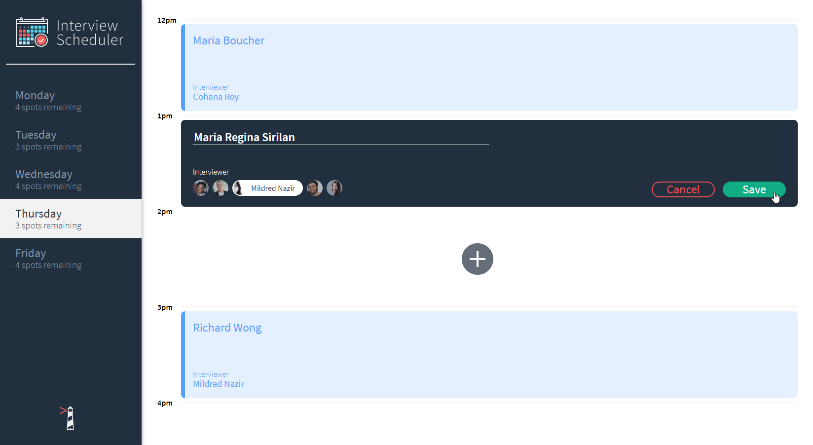
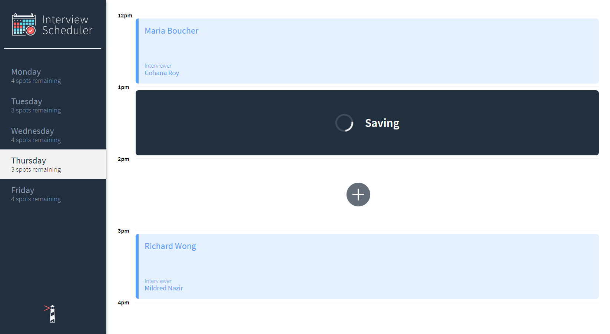
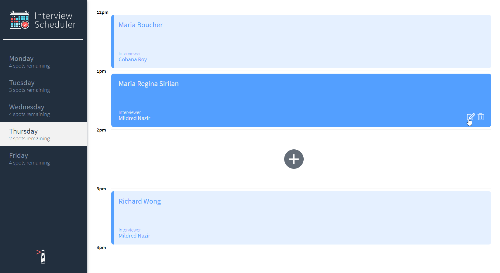

# 📅 Interview Scheduler

<b>Interview Scheduler</b> is a front-end React application that allows users to book and cancel interviews.

Built with [React](https://reactjs.org/) and CSS/<a href="https://sass-lang.com/">SASS</a>. Tested using [Jest](https://jestjs.io/[) and [Storybook](https://storybook.js.org/).

## 🛠 Installation

The project is live
<b><a href="https://inquizitor-app.herokuapp.com/" target="_blank">here</a></b>, but if you would prefer a local installation:

1. Clone or download this repository
   ```
   git clone https://github.com/ahhreggi/scheduler
   ```
2. Navigate to the project directory and install dependencies
   ```
   cd scheduler
   npm install
   ```
3. Run the webpack development server
   ```
   npm start
   ```
5. Visit <a href="http://localhost:8000/">http://localhost:8000/</a> on your browser

## ✔️ Testing (Jest, Storybook)

1. Run the Jest test framework
   ```
   npm test
   ```
2. Run the Storybook visual testbed
   ```
   npm run storybook
   ```

## 📷 Screenshots




