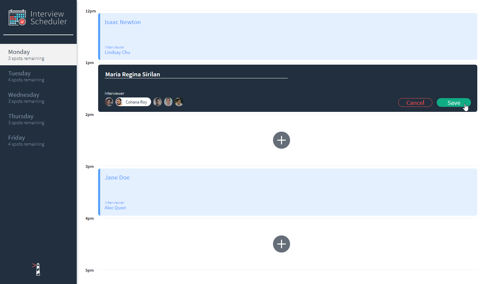
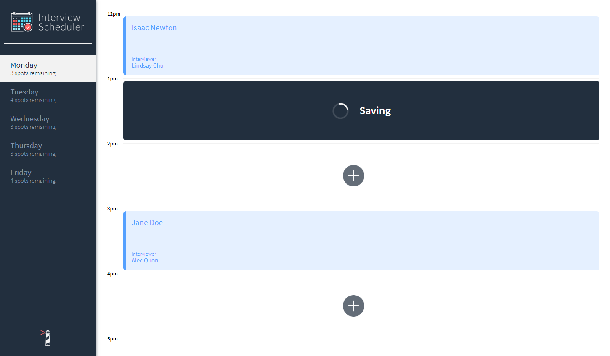
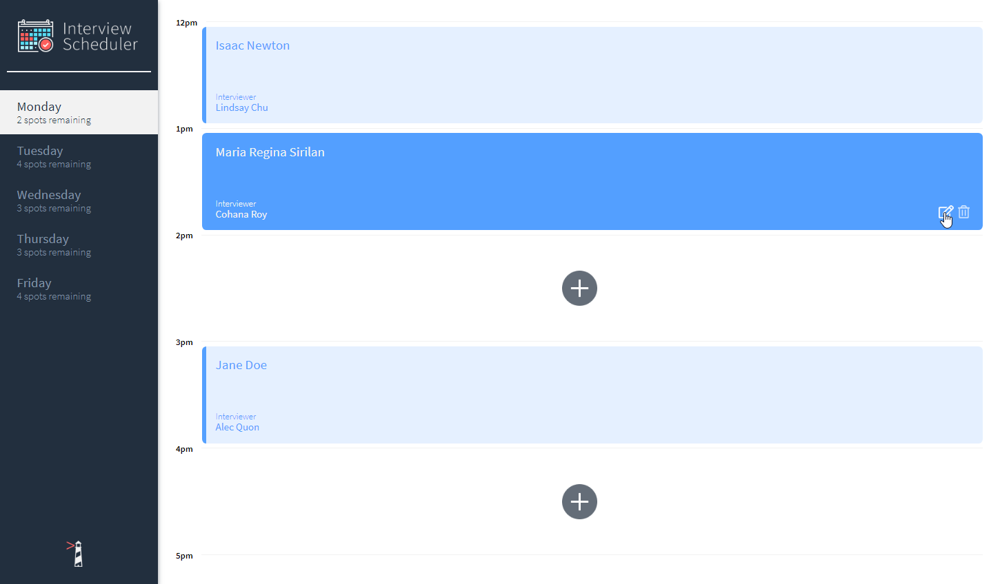

<!-- TITLE -->
<div align="center">
<h1>
<a href="https://ahhreggi-scheduler.netlify.app/">

<a>
</h1>
<p>A full-stack application for scheduling interviews
</p>

<p>Built with <a href="https://nodejs.org/en/">Node.js</a>, <a href="https://expressjs.com/">Express</a>, <a href="https://www.postgresql.org/">PostgreSQL</a>, <a href="https://reactjs.org/">ReactJS</a>, CSS/<a href="https://sass-lang.com/">SASS</a>, and hosted with <a href="https://www.heroku.com/">Heroku</a> & <a href="https://www.netlify.com/">Netlify</a></p>

<b><a href="https://ahhreggi-scheduler.netlify.app/" target="_blank">
   » View Live Demo «
</a></b>

</div>

<!-- INTRODUCTION -->

## 📚 Introduction

<b>[Interview Scheduler](https://ahhreggi-scheduler.netlify.app/)</b> is a full-stack, single-page React application that allows users to book and cancel interviews. [WebSockets](https://javascript.info/websocket) are used to enable continuous data exchange between all concurrent clients and the server, allowing users to see schedule changes made by other users in real-time without reload.

## ⚛️ Tech Usages

- <b>Development</b>: <a href="https://reactjs.org/">ReactJS</a>, CSS/<a href="https://sass-lang.com/">SASS</a>, <a href="https://nodejs.org/en/">Node.js</a>, <a href="https://expressjs.com/">Express</a>, <a href="https://www.postgresql.org/">PostgreSQL</a>
- <b>Tools & Testing</b>: <a href="https://storybook.js.org/">Storybook<a/>, <a href="https://jestjs.io/">Jest</a>, <a href="https://www.cypress.io/">Cypress</a>
- <b>Deployment</b>: <a href="https://www.heroku.com/">Heroku</a> (database API), <a href="https://circleci.com/">CircleCI</a> (continuous integration), <a href="https://www.netlify.com/">Netlify</a> (production client)

## 🛠 Installation

The project is live
<b><a href="https://ahhreggi-scheduler.netlify.app/" target="_blank">here</a></b>, but if you would prefer a local installation:

1. Clone or download this repository
   ```
   git clone https://github.com/ahhreggi/scheduler
   ```
2. Clone or download the [API repository](https://github.com/ahhreggi/scheduler-api)
   ```
   git clone https://github.com/ahhreggi/scheduler-api
   ```
3. Install dependencies and start the API server
   ```
   cd scheduler-api
   npm install
   npm start
   ```
5. Install dependencies and start the webpack development server
   ```
   cd scheduler
   npm install
   npm start
   ```
7. Visit <a href="http://localhost:8000/">http://localhost:8000/</a> on your browser

## ✔️ Tools & Testing (Storybook, Jest, Cypress)

1. Run the Storybook visual testbed
   ```
   npm run storybook
   ```
2. Run the Jest test framework
   ```
   npm test
   ```
3. Run the Cypress test runner
   ```
   npm run cypress
   ```

## 📷 Screenshots




